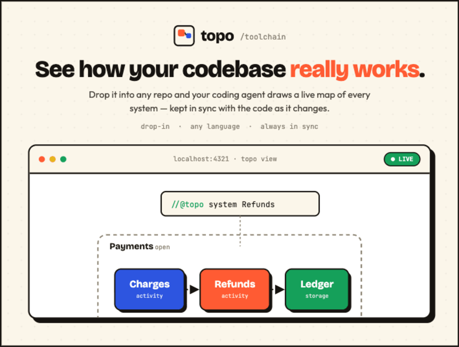

<p align="center">
  
</p>

# Drop it into any repo and your coding agent draws a live map of every system — kept in sync with the code as it changes.

drop-in · any language · local-only · bring your own AI · always in sync

---

## ▸ Hand it to your agent

Topo is built to be run **by your coding agent** (Claude Code, Cursor, or any agent), not by hand. Paste the prompt below into your agent, in the repo you want to understand, and watch the map appear:

```text
Set up Topo in this repo so I can see how it works as a live map.

1. Make the CLI available — nothing global:
     • repo has a package.json:  npm i -D github:kallemoen/topo-toolchain
       then run every command as `npx topo <cmd>`
     • otherwise, zero-install:  npx github:kallemoen/topo-toolchain <cmd>
2. Run:  topo init   — scaffolds an empty map + a pre-commit hook and installs
   the Topo skill at .claude/skills/topo/.
3. Read .claude/skills/topo/SKILL.md and follow it: in system.topo, design the
   systems, the arrows between them, and the data shapes that flow (thing
   declarations with fields), then give each system a code "glob" line so every
   source file is owned. Do NOT add comments to my code — the whole map lives
   in system.topo.
4. Run `topo check` (fix what it lists), then `topo approve`, until the check is
   green. Then `topo view` so I can watch the live map in my browser.

Then keep it green: whenever you change structure or move code, update system.topo,
run `topo approve`, and never finish with `topo check` red.
```

No setup, no account, no keys, **no native build** — it installs as plain JS and works in sandboxes. Nothing leaves your repo.

> Prefer a global `topo` on your PATH? `npm i -g --install-links github:kallemoen/topo-toolchain` — the `--install-links` flag is required (it makes npm fetch the tarball instead of a git-clone symlink that dangles). Flag-free alternative: `npm i -g "https://github.com/kallemoen/topo-toolchain/archive/refs/heads/main.tar.gz"`.

---

## What you get

- **The whole system, one screen.** Boxes for every part, arrows for every connection — nested as deep as your code goes.
- **Click in to understand it.** Open a box to see what's inside. Follow a piece of data from where it's born to where it rests.
- **Never out of date.** The map is built from your code, so it can't quietly rot the way a diagram in a doc does.

Run `topo view` and a local map opens in your browser. Open boxes to drill in, follow the arrows to trace data, and watch it redraw the instant you save. The moment something in code doesn't match, it's flagged right on the map.

## A map that can't lie to you

Most diagrams are wrong within a week. Topo pins each system to the code it owns and hashes that code into a lockfile — so a check fails the moment the map and the code disagree, before you ever see a stale picture.

1. **One manifest, authored top-down.** `system.topo` holds the whole design — the systems, the arrows between them, and a `code "glob"` naming the files each system owns. Your agent writes it as a whole, not comment-by-comment. **No markers in your code.**
2. **The check is the gate.** `topo check` re-hashes every owned region and fails on any drift: code no system owns, a region whose code changed, or a glob pointing at nothing — naming the exact file. Wire it into a pre-commit hook and "done" requires a green map.
3. **Your agent keeps it green.** An installed skill + rule make updating the map non-optional. The agent loops update `system.topo` → `topo check` → `topo approve` until it's green — no human in the loop. The `system.topo` + `system.topo.lock` diff in the PR is the review surface.

## How your agent maps it

Your agent writes one file, `system.topo` — no comments in your code. It draws the systems, draws the arrows between them deliberately, and declares which files each system owns:

```
system Payments {
  code "src/payments/**"           // the files this system owns
  activity Charges { }
  storage Ledger { }
  Charges --( Charge )--> Ledger   // you draw the arrows, not a heuristic
}
```

Topo hashes the files under each `code` glob into `system.topo.lock`. Add or change code a system owns and the check flags it — so the picture stays honest, while the design stays something a person authored, not something scraped from fragments.

## Four commands. That's the whole tool.

The everyday loop is `check` → `approve`.

| Command | What it does | Exit |
|---|---|---|
| `topo init` | Drop the tool in: scaffold the manifest, the agent skill + rule, and a pre-commit hook. Idempotent, never clobbers. | `0` / `2` |
| `topo check` | Hash the declared code regions, diff against the lock, report drift. The gate that keeps the picture honest. | `0` sync · `1` drift · `2` error |
| `topo approve` | Record the current map + code as approved — writes `system.topo.lock`, reaching green. `topo approve <System…>` re-locks just those. | `0` / `2` |
| `topo view` | Open the live map in your browser — the part you actually look at. Redraws on every save. | `0` / `2` |

## The manifest and the lock

- **`system.topo`** is the manifest you author: the systems, the arrows, and each system's `code "glob"`. It is the design *and* the code map, in one place.
- **`system.topo.lock`** is generated by `topo approve`: every owned file's hash, rolled up per system, plus a hash of the manifest. Commit it — the diff is exactly what changed and what was re-approved.

Coverage is whole-repo by default (every source file must be owned) and tunable in `topo.config.json` under `policy` — loosen coverage, or require a human to run `topo approve`.

## Notes

- **Bring your own AI.** Topo ships no model and manages no keys — it's the mechanical referee your agent acts on.
- **Local-only.** The viewer and check run on your machine; nothing leaves the repo.
- **No comments in your code.** The whole map lives in `system.topo`; systems own files by glob, so it works in any language and never touches your source.
- **Requires Node ≥ 20.** The viewer is prebuilt and committed, so `topo view` runs with no build step.

## Develop

```bash
git clone https://github.com/kallemoen/topo-toolchain && cd topo-toolchain
npm install
npm run typecheck      # tsc --noEmit
npm test               # vitest (serialize round-trip, coverage/ownership, digest + lock)
npm run topo -- check --dir <repo>     # run the CLI from source via tsx
npm run build:viewer   # rebuild the viewer bundle into src/assets/viewer-dist
npm run build          # bundle the CLI → dist/topo.mjs (commit this before pushing)
```

The shipped CLI is a single pre-bundled file, `dist/topo.mjs`, with **no runtime dependencies and no install scripts** — so installing is just a file copy, with no esbuild/native postinstall to fail in a sandbox. `dist/` is committed; run `npm run build` and commit it whenever you change `src/`. (The `--install-links` flag on the global install is what makes npm fetch the committed tarball instead of a git clone — without it, npm 9–11 symlink the global package to an ephemeral cache clone that dangles once the cache is pruned.)

Stack: Node 20 + TypeScript + ESM, bundled with esbuild; the viewer is Vite + React 19 + [`@xyflow/react`](https://github.com/xyflow/xyflow). No model, no API keys, no cloud.

## License

MIT
