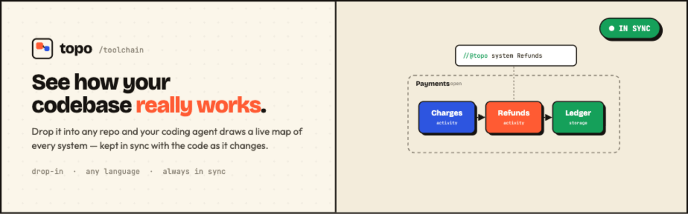

<p align="center">
  
</p>

# Drop it into any repo and your coding agent draws a live map of every system — kept in sync with the code as it changes.

drop-in · any language · local-only · bring your own AI · always in sync

---

## ▸ Hand it to your agent

Topo is built to be run **by your coding agent** (Claude Code, Cursor, or any agent), not by hand. Paste the prompt below into your agent, in the repo you want to understand, and watch the map appear:

```text
Set up Topo in this repo so I can see how it works as a live map.

1. Install the CLI once:  npm i -g github:kallemoen/topo-toolchain
2. Run:  topo init   — scaffolds the map, an agent skill, a rule, and a
   pre-commit hook. It also installs .claude/skills/topo-sync/ — READ IT.
3. Add //@topo comment markers to each significant system (service, module,
   job, datastore), right where it lives in the code. The keyword is the kind:
     //@topo system   <Name> [parent=<Parent>]   # an open container (has children)
     //@topo activity <Name> [parent=<Parent>]   # does something
     //@topo storage  <Name> [parent=<Parent>]   # holds things
     //@topo gateway  <Name>                      # an external dependency
     //@topo in <Thing>     # data the system accepts
     //@topo out <Thing>    # data the system emits
   Names and Things are single words (no spaces). Connections are derived
   from out↔in — never write them by hand.
4. Run:  topo sync    — writes the live map from your markers.
5. Run:  topo check   — must be green (exit 0). If red, fix the markers and
   go back to step 4. Repeat until green.
6. Run:  topo view    so I can watch the map live in my browser.

Keep the //@topo markers in sync whenever you change structure, run
`topo sync` after, and never finish with `topo check` red.
```

No setup, no account, no keys, **no native build** — it installs as plain JS and works in sandboxes. Nothing leaves your repo.

> Prefer not to install globally? Every command also works as `npx github:kallemoen/topo-toolchain <cmd>`.

---

## What you get

- **The whole system, one screen.** Boxes for every part, arrows for every connection — nested as deep as your code goes.
- **Click in to understand it.** Open a box to see what's inside. Follow a piece of data from where it's born to where it rests.
- **Never out of date.** The map is built from your code, so it can't quietly rot the way a diagram in a doc does.

Run `topo view` and a local map opens in your browser. Open boxes to drill in, follow the arrows to trace data, and watch it redraw the instant you save. The moment something in code doesn't match, it's flagged right on the map.

## A map that can't lie to you

Most diagrams are wrong within a week. Topo keeps tiny markers next to the code they describe, and a check that fails the moment the map and the code disagree — so your agent fixes it before you ever see a stale picture.

1. **Markers live in the code.** A one-line `//@topo` comment marks each system, right where it's written. Move the code, the marker moves with it.
2. **The check is the gate.** `topo check` compares code to map and fails on any drift — pointing at the exact `file:line`. Wire it into a pre-commit hook and "done" requires a green map.
3. **Your agent keeps it green.** An installed skill + rule make updating the map non-optional. The agent loops fix markers → `topo sync` → `topo check` until it's green — no human in the loop. (A `propose`/`approve` review gate is there when you *want* to eyeball a change first.)

## How your agent marks it up

You don't write these by hand — the agent does. It tags each system where it lives, names the data crossing its edges, and **Topo derives the connections for you**: one part's `out` meeting another's `in` becomes an arrow.

```ts
// payments/charge.ts — a one-line tag, next to the code
//@topo activity Charges parent=Payments
//@topo out Charge
```

`Charges` becomes a box on the map, wired by its boundary. Anything that emits `Charge` now points into whatever accepts `Charge` — automatically. Connections are **derived, never hand-drawn**.

## Six commands. That's the whole tool.

The everyday loop is just `sync` → `check`. `propose`/`approve` are an optional human-review gate.

| Command | What it does | Exit |
|---|---|---|
| `topo init` | Drop the tool in: scaffold the map, the agent skill + rule, and a pre-commit hook. Idempotent, never clobbers. | `0` / `2` |
| `topo sync` | Regenerate the live map from the code markers. The agent's normal loop to reach a green check. | `0` / `2` |
| `topo check` | Compare code to map and report drift. The gate that keeps the picture honest. | `0` sync · `1` drift · `2` error |
| `topo view` | Open the live map in your browser — the part you actually look at. Redraws on every save. | `0` / `2` |
| `topo propose` | *(optional)* Regenerate to a **draft** map instead of live, for a human to review. | `0` / `2` |
| `topo approve` | *(optional)* Accept the draft as the live map (or `--reject` to discard). | `0` / `1` / `2` |

## The map vs. the markers

- **Markers** carry structure: which systems exist, their kind, open/closed, parent, and boundary (`in`/`out`/`holds`).
- **The `.topo` map** keeps the design judgment markers can't: thing field schemas, gateway identity, grouping, descriptions, and explicit connection overrides.

Regeneration **merges** — markers drive structure while the map's design choices are preserved. That collapses "three things that can disagree" (code, markers, map) into one mechanical check.

## Notes

- **Bring your own AI.** Topo ships no model and manages no keys — it's the mechanical referee your agent acts on.
- **Local-only.** The viewer and check run on your machine; nothing leaves the repo.
- **Language-agnostic.** Markers are found by simple comment-pattern matching, so they work in any language and never affect runtime.
- **Requires Node ≥ 20.** The viewer is prebuilt and committed, so `topo view` runs with no build step.

## Develop

```bash
git clone https://github.com/kallemoen/topo-toolchain && cd topo-toolchain
npm install
npm run typecheck      # tsc --noEmit
npm test               # vitest (grammar, scan, serialize round-trip, compare, merge)
npm run topo -- check --dir <repo>     # run the CLI from source via tsx
npm run build:viewer   # rebuild the viewer bundle into src/assets/viewer-dist
npm run build          # bundle the CLI → dist/topo.mjs (commit this before pushing)
```

The shipped CLI is a single pre-bundled file, `dist/topo.mjs`, with **no runtime dependencies and no install scripts** — that's what makes `npm i -g github:…` a reliable file-copy in restricted sandboxes. `dist/` is committed; run `npm run build` and commit it whenever you change `src/`.

Stack: Node 20 + TypeScript + ESM, bundled with esbuild; the viewer is Vite + React 19 + [`@xyflow/react`](https://github.com/xyflow/xyflow). No model, no API keys, no cloud.

## License

MIT
